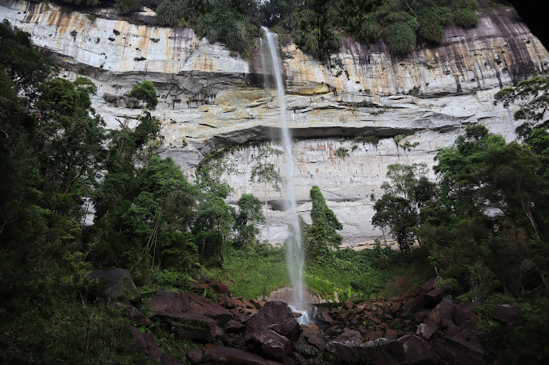
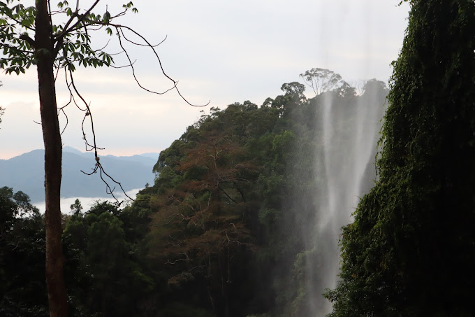
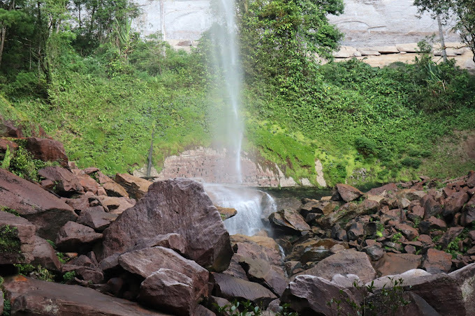
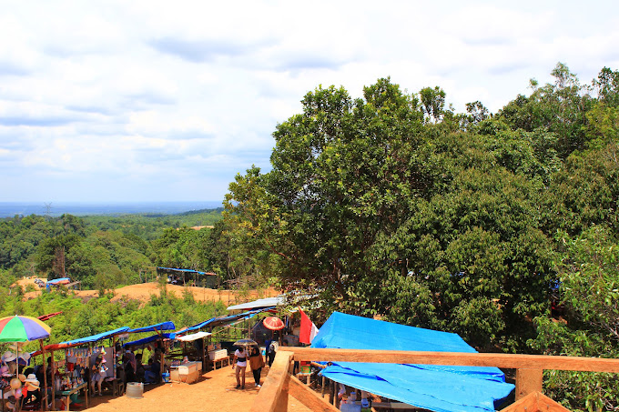
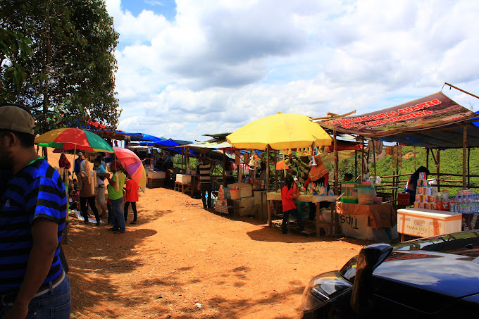
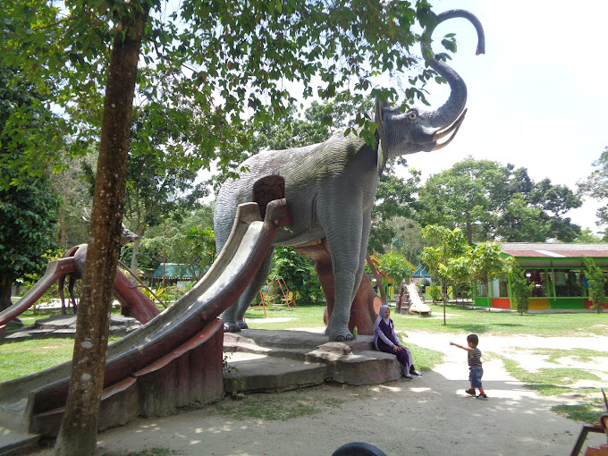

# Warna
- Hijau Muda : #78d858
- Hijau Tua : #00bf63
- Abu abu : #737373

# Jumlah halaman
- 1

# Tanpa Loading
- Ya

# Title
- AlamRiau

# Favicon

# Navbar
- Teks : ALAM RIAU
    - ALAM : Hijau Tua
    - RIAU : Putih
- Menu
    - beranda
    - destinasi
    - aktivitas
    - galeri
    - informasi
    - testimoni
    - kontak

# Slideshow Gambar wisata
- 
- 
- 
- 
- 
- 

# Destinasi wisata alam riau
- Air Terjun Batang Kapas
    - Air terjun batang kapas ini memiliki ketinggian sekitar 150 meter. Untuk mencapai wisata Riau ini membutuhkan perjuangan yang ekstra. Letaknya cukup jauh dari Pekanbaru, jadi kamu perlu menempuh jarak sekitar tiga jam setengah terlebih dahulu. Namun saat tiba di lokasi air terjun ini, kamu akan melihat sebuah keindahan alam yang begitu menakjubkan.

- Ulu Kasok
    - Terletak di Desa Pulau Gadang, Kecamatan XIII, Koto Kampar, wisata Riau satu ini menawarkan pemandangan yang sekilas mirip dengan Raja Ampat. Bahkan, wisatawan yang ke lokasi ini menyebutnya dengan Raja Ampat ala Kampar.

    - Ulu Kasok terdiri dari beberapa pulau yang terletak di tengah bendungan Pembangkit Listrik Tenaga Air (PLTA) Koto Panjang. Air yang mengelilingi pulau masih hijau dengan hutan yang masih lebat, sehingga menyajikan pemandangan yang menakjubkan. Ulu Kasok menyajikan tiga objek wisata, di antaranya air terjun Ulu Kasok, wisata pulau dengan naik speedboat untuk berkeliling ataupun mengitari pulau, dan terakhir adalah Puncak Ulu Kasok. Dari Kota Pekanbaru, jarak tempuh ke Ulu Kasok sekitar satu setengah jam.

- Sungai Kampar
    - Buat kamu yang memiliki hobi berselancar, bisa mencoba berkunjung ke wisata Riau yang satu ini. Namanya adalah sungai Kampar. Ketika biasanya orang-orang berselancar di laut, kamu bisa melakukannya di sungai Kampar ini. Adanya gelombang pasang surut atau ombak yang dikenal secara lokal sebagai Bono, yang bergegas dengan suara menderu keras pada kecepatan 40 kilometer per jam.

    - Wisata Riau satu ini sudah dikenal oleh dunia internasional. Buktinya banyak peselancar dunia yang sudah mencoba ombak di sungai Kampar ini. Gelombang di sungai ini memiliki sifat yang berbeda dengan laut terbuka. Ini dikarenakan kekuatan gelombang yang melaju, arus yang bergegas ke hulu akan menyebabkan gelombang dari kedua sisi kiri setelah memukul kedua tanggul sungai. Meski hanya berupa sungai, tinggi Gelombang Bono bisa mencapai 6 meter dengan kecepatan mencapai 40 km/jam.

- Rainbow Hills
    - Berjarak sekitar 10 km dari jantung Kota Pekanbaru, ada sebuah lokasi wisata Riau yang relatif baru dan unik. Tempat ini diberi nama “Rainbow Hills” atau Bukit Pelangi. Seperti namanya, perbukitan di tempat ini benar-benar berwarna-warni. Perpaduan warna yang unik membuat bukit-bukitnya terlihat seperti pelangi dari kejauhan. Kontur (garis ketinggian) dan warna tanah di perbukitan Rainbow Hills yang berlokasi di Danau Kahyangan, Rumbai, Pekanbaru, Riau ini bisa berubah-ubah kapan saja.

- Kawah Biru
    - Wisata Riau yang berikutnya adalah Kawah Biru. Kawah Biru ini awalnya terbentuk dari letusan Gunung Merapi yang membentuk sebuah lubang. Kemudian lubang tersebut ditambah dengan adanya bekas galian pasir dan jadilah sebuah kawah yang indah. Sekarang menjadi tempat wisata andalan di Pekanbaru. Dengan pasir putih dan airnya yang kebiruan menjadi background foto yang instagramable.

- Taman Wisata Alam Mayang
    - Meski padat kawasan industri, Kota Pekanbaru menawarkan berbagai tempat rekreasi menarik, contohnya, Taman Wisata Alam Mayang. Konsepnya berupa taman hijau terbuka dan dilengkapi beragam wahana yang mengasyikkan, seperti flying fox, kolam pemancingan, sepeda air, bumper cars, dan kereta safari. Selain wahana menarik, terdapat pula spot berfoto yang unik, yaitu deretan 4 patung raksasa di sekitar gerbang taman, candi miniatur, 6 buah replika patung Pulau Paskah, dan replika perahu ciri khas Riau.

# Aktivitas
- Air Terjun Batang Kapas
    1. Bermain air dan berenang

        Air di Air Terjun Batang Kapas sangat jernih dan menyegarkan. Pengunjung dapat bermain air dan berenang di kolam alami yang terdapat di bawah air terjun.
    
    2. Trekking

        Trekking merupakan aktivitas yang wajib dilakukan saat berkunjung ke Air Terjun Batang Kapas. Pengunjung dapat menikmati pemandangan alam yang indah selama perjalanan menuju air terjun.

    3. Berfoto

        Air Terjun Batang Kapas memiliki banyak spot foto yang menarik. Pengunjung dapat berfoto dengan latar belakang air terjun, hutan, atau bebatuan.

    4. Berkemah

        Bagi yang ingin menikmati suasana alam yang lebih tenang, pengunjung dapat berkemah di sekitar Air Terjun Batang Kapas.

    5. Menikmati kuliner lokal

        Di sekitar Air Terjun Batang Kapas terdapat beberapa warung makan yang menyajikan kuliner lokal. Pengunjung dapat menikmati hidangan khas Riau seperti ikan patin, gulai pakis, dan rendang.

- Ulu Kasok
    1. Menikmati Pemandangan Alam

        Ulu Kasok terkenal dengan pemandangan alamnya yang indah, dengan perbukitan hijau, danau biru, dan pulau-pulau kecil yang menawan. Pengunjung dapat menikmati pemandangan ini dari berbagai sudut, seperti dari Puncak Ulu Kasok, Bukit Suligi, atau dengan berkeliling danau menggunakan perahu.

    2. Berfoto

        Ulu Kasok adalah tempat yang instagrammable dengan banyak spot foto yang menarik. Pengunjung dapat berfoto di Puncak Ulu Kasok dengan latar belakang danau dan pulau-pulau, di Bukit Suligi dengan pemandangan hutan yang asri, atau di dermaga dengan perahu-perahu yang bersandar.

    3. Berkemah

        Bagi yang ingin merasakan pengalaman yang lebih dekat dengan alam, Ulu Kasok menyediakan tempat untuk berkemah. Pengunjung dapat membawa tenda sendiri atau menyewa tenda di lokasi wisata.

    4. Menjelajahi Pulau-Pulau

        Di sekitar Danau Ulu Kasok terdapat beberapa pulau kecil yang dapat dijelajahi oleh pengunjung. Pengunjung dapat menyewa perahu untuk mengunjungi pulau-pulau ini dan menikmati suasana yang lebih tenang.

    5. Berenang

        Bagi yang ingin berenang, terdapat beberapa spot di Danau Ulu Kasok yang aman untuk berenang. Pengunjung dapat berenang di tepi danau atau di kolam renang yang disediakan di lokasi wisata.

    6. Memancing

        Bagi yang hobi memancing, Danau Ulu Kasok adalah tempat yang ideal untuk memancing. Pengunjung dapat memancing dari tepi danau atau menyewa perahu untuk memancing di tengah danau.

    7. Menikmati Kuliner Lokal

        Di Ulu Kasok terdapat beberapa warung makan yang menyajikan kuliner lokal khas Riau. Pengunjung dapat mencoba berbagai macam makanan, seperti ikan bakar, gulai ikan, dan sambal lado mudo.

    8. Berbelanja Souvenir

        Di Ulu Kasok terdapat beberapa toko souvenir yang menjual berbagai macam souvenir khas Riau, seperti kain songket, miniatur perahu, dan gantungan kunci.

- Sungai Kampar
    1. Menikmati Keindahan Alam

        Sungai Kampar memiliki panorama alam yang indah dengan aliran air yang jernih dan deretan pepohonan rindang di tepiannya. Pengunjung dapat menikmati keindahan alam ini dengan cara bersantai di tepi sungai, berjalan kaki, atau bersepeda.

    2. Berenang dan Bermain Air

        Sungai Kampar memiliki air yang jernih dan menyegarkan sehingga cocok untuk berenang dan bermain air. Pengunjung dapat berenang di area yang dangkal atau mencoba bermain air dengan menggunakan ban karet.

    3. Mencoba Sensasi Bono

        Bono adalah fenomena alam berupa gelombang besar yang terjadi di Sungai Kampar. Gelombang ini dapat mencapai ketinggian hingga 6 meter dan menjadi daya tarik utama bagi wisatawan. Pengunjung dapat mencoba sensasi Bono dengan cara berselancar atau simply menikmati pemandangannya dari tepi sungai.

    4. Menjelajahi Hutan

        Di sepanjang aliran Sungai Kampar terdapat banyak hutan yang masih alami. Pengunjung dapat menjelajahi hutan ini dengan cara trekking atau mengikuti wisata alam yang disediakan oleh penduduk setempat.

    5. Mengunjungi Desa-desa Tradisional

        Di sepanjang aliran Sungai Kampar terdapat banyak desa tradisional yang masih menjaga adat istiadat dan budaya leluhur. Pengunjung dapat mengunjungi desa-desa ini untuk belajar tentang budaya setempat dan melihat kehidupan masyarakat tradisional.

    6. Mencicipi Kuliner Khas

        Di sekitar Sungai Kampar terdapat banyak warung makan yang menyajikan kuliner khas Riau. Pengunjung dapat mencicipi berbagai macam makanan khas seperti ikan patin, gulai tambunsu, dan laksa.

- Rainbow Hills
    1. Menikmati pemandangan

        Pemandangan alam di Rainbow Hills Rumbai sangatlah indah dan unik. Perbukitan berwarna-warni menjadi daya tarik utama tempat ini. Anda dapat menikmati pemandangan dari atas bukit, atau berjalan-jalan di sekitar bukit untuk melihat lebih dekat.

    2. Berfoto

        Rainbow Hills Rumbai adalah tempat yang instagramable. Banyak spot foto menarik yang bisa Anda temukan di sini, seperti di atas bukit, di depan perbukitan berwarna-warni, atau di taman bunga.

    3. Berpetualang

        Bagi Anda yang menyukai petualangan, Anda dapat mencoba trekking atau hiking di sekitar bukit. Ada beberapa jalur trekking yang tersedia dengan tingkat kesulitan yang berbeda-beda.
        Bersepeda: Anda juga dapat bersepeda di sekitar bukit. Ini adalah cara yang menyenangkan untuk menjelajahi tempat ini dan menikmati udara segar.

    4. Berpiknik

        Anda dapat membawa makanan dan minuman sendiri untuk piknik di Rainbow Hills Rumbai. Ada beberapa tempat piknik yang tersedia di sini, dengan pemandangan yang indah.

    5. Bermain ATV

        Anda dapat menyewa ATV untuk berkeliling bukit. Ini adalah cara yang seru untuk menjelajahi tempat ini dan merasakan sensasi adrenalin.

    6. Bermain flying fox

        Ada flying fox yang tersedia di Rainbow Hills Rumbai. Anda dapat mencoba flying fox untuk merasakan sensasi terbang di atas bukit.

    7. Menonton pertunjukan

        Kadang-kadang, ada pertunjukan musik atau tari tradisional yang diadakan di Rainbow Hills Rumbai. Anda dapat menonton pertunjukan ini untuk menghibur diri.

- Kawah Biru
    1. Berfoto

        Kawah Biru memiliki pemandangan yang indah dan unik dengan air berwarna biru kehijauan yang dikelilingi oleh tebing-tebing putih. Tempat ini sangat cocok untuk berfoto dan menghasilkan foto-foto yang instagramable.

    2. Berenang

        Air di Kawah Biru cukup jernih dan menyegarkan. Pengunjung dapat berenang di kawah ini untuk menikmati suasana yang tenang dan menyejukkan.

    3. Berkeliling dengan perahu

        Pengunjung dapat menyewa perahu untuk berkeliling kawah dan melihat pemandangan dari sudut pandang yang berbeda.

    4. Menikmati sunset

        Kawah Biru merupakan tempat yang ideal untuk menikmati sunset. Pengunjung dapat duduk di tepi kawah dan menikmati pemandangan matahari terbenam yang indah.

    5. Berkemah

        Bagi yang ingin merasakan pengalaman yang lebih seru, pengunjung dapat berkemah di sekitar Kawah Biru. Pengalaman ini memungkinkan pengunjung untuk menikmati suasana alam yang tenang dan damai di malam hari.

    6. Menjelajahi gua

        Di sekitar Kawah Biru terdapat beberapa gua yang dapat dijelajahi oleh pengunjung. Pengalaman ini akan memberikan sensasi yang berbeda dan menantang.

    7. Mencoba kuliner lokal

        Di sekitar Kawah Biru terdapat beberapa warung makan yang menyajikan kuliner khas Riau. Pengunjung dapat mencoba berbagai macam makanan dan minuman yang lezat.

- Taman Wisata Alam Mayang

    1.  Berpiknik di taman

        Taman Wisata Alam Mayang memiliki taman yang luas dan rindang, cocok untuk bersantai dan menikmati udara segar. Anda bisa membawa tikar dan makanan sendiri, atau membeli makanan di restoran yang ada di dalam taman.

    2. Menikmati pemandangan danau

        Di dalam taman terdapat sebuah danau yang indah. Anda bisa duduk di tepi danau sambil menikmati pemandangan atau menyewa perahu untuk berkeliling danau.

    3. Memancing

        Bagi yang suka memancing, Taman Wisata Alam Mayang menyediakan kolam pemancingan khusus. Anda bisa membawa peralatan pancing sendiri atau menyewanya di tempat.

    4. Bersepeda

        Di dalam taman terdapat jalur khusus untuk bersepeda. Anda bisa menyewa sepeda di tempat dan berkeliling taman sambil menikmati suasana alam.

    5. Outbond

        Taman Wisata Alam Mayang menyediakan berbagai fasilitas outbound, seperti flying fox, paintball, dan wall climbing. Cocok untuk Anda yang suka tantangan dan ingin menguji adrenalin.

    6. Bermain ATV

        Anda bisa menyewa ATV dan menjelajahi area taman yang luas.

    7. Bermain air

        Di taman terdapat kolam renang dan waterpark untuk anak-anak. Anda bisa bermain air dan bersenang-senang bersama keluarga.

    8. Bermain paintball

        Bagi yang suka permainan perang-perangan, Anda bisa mencoba bermain paintball di arena yang disediakan.

# Galeri
- Air Terjun Batang Kapas
    - 
    - 
    - 
    - 
    - 
    - 

- Ulu Kasok
    - 
    - 
    - 
    - 
    - 
    - 
    - 

- Sungai Kampar
    - 
    - 
    - 
    - 
    - 

- Rainbow Hills
    - 
    - 
    - 
    - 
    - 
    - 

- Kawah Biru
    - 
    - 
    - 
    - 

- Taman Wisata Alam Mayang
    - 
    - 
    - 
    - 
    - 
    - 
    - 

# Informasi
- Air Terjun Batang Kapas

    Lokasi: Desa Batang Kapas, Kecamatan Kampar Kiri Hulu, Kabupaten Kampar, Riau.  
    Jam buka: 24 jam  
    Harga tiket: Rp 10.000  
    Fasilitas: Gazebo, toilet, mushola, tempat parkir.  

- Ulu Kasok

    Lokasi: Desa Tanjung Belit, Kecamatan Kampar Kiri Hulu, Kabupaten Kampar, Riau.  
    Jam buka: 06.00 - 18.00 WIB  
    Harga tiket: Rp 10.000  
    Fasilitas: Gazebo, toilet, mushola, tempat parkir, warung makan.  

- Sungai Kampar

    Lokasi: Kabupaten Kampar, Riau.  
    Jam buka: 24 jam  
    Harga tiket: Gratis  
    Fasilitas: Dermaga, tempat parkir, warung makan.  

- Rainbow Hills

    Lokasi: Desa Sei Pinang, Kecamatan Siak Hulu, Kabupaten Kampar, Riau.  
    Jam buka: 07.00 - 18.00 WIB  
    Harga tiket: Rp 20.000  
    Fasilitas: Gazebo, toilet, mushola, tempat parkir, warung makan.  

- Kawah Biru

    Lokasi: Desa Bukit Suligi, Kecamatan Koto Kampar Hulu, Kabupaten Kampar, Riau.  
    Jam buka: 08.00 - 18.00 WIB  
    Harga tiket: Rp 10.000  
    Fasilitas: Gazebo, toilet, mushola, tempat parkir, warung makan.  

- Taman Wisata Alam Mayang

    Lokasi: Jalan Imam Munandar Km 8, Pekanbaru, Riau.  
    Jam buka: 08.00 - 17.00 WIB  
    Harga tiket:  
    Dewasa: Rp 20.000  
    Anak-anak: Rp 15.000  
    Fasilitas: Restoran, toilet, mushola, tempat parkir, gazebo, aula  

# Testimoni
- Air Terjun Batang Kapas

    "Air Terjun Batang Kapas benar-benar menakjubkan! Airnya yang jernih dan segar, dikelilingi oleh hutan yang rimbun, membuat tempat ini terasa begitu asri dan menenangkan. Pemandangan air terjunnya pun sangat indah, membuat saya ingin terus berlama-lama di sana."

- Ulu Kasok

    "Ulu Kasok adalah tempat wisata yang unik dan menarik. Pemandangan pulau-pulau kecil di tengah bendungan yang dikelilingi oleh hutan tropis sungguh luar biasa. Saya juga senang mencoba berbagai aktivitas yang tersedia di sana, seperti trekking, kayaking, dan berenang."

- Sungai Kampar

    "Sungai Kampar adalah tempat yang tepat untuk wisata alam dan petualangan. Saya menikmati arung jeram di sungai yang deras dan menantang. Pemandangan di sepanjang sungai pun sangat indah, dengan perbukitan hijau dan hutan yang lebat."

- Rainbow Hills

    "Rainbow Hills adalah tempat wisata yang instagrammable. Bukit-bukit berwarna-warni dengan berbagai bentuk dan pola membuat tempat ini sangat unik dan menarik. Saya senang berfoto-foto di sana dan menikmati pemandangan yang indah."

- Kawah Biru

    "Kawah Biru adalah tempat wisata yang masih alami dan belum banyak dikunjungi orang. Airnya yang berwarna biru jernih dan dikelilingi oleh tebing-tebing tinggi membuat tempat ini terasa begitu eksotis dan misterius. Saya senang berenang di kawah dan menikmati suasana yang tenang dan damai."

- Taman Wisata Alam Mayang

    "Taman Wisata Alam Mayang adalah tempat wisata yang cocok untuk keluarga. Ada banyak aktivitas yang bisa dilakukan di sana, seperti piknik, bermain air, dan outbound. Saya senang menghabiskan waktu bersama keluarga di taman ini dan menikmati suasana yang menyenangkan."

# Kontak
Form :
- nama
- pesan
Button :
- Kirim

- Link

    https://api.whatsapp.com/send?phone=6285168453211&text=Saya%20nama%2C%20pesan

# Footer
Email : alamriau@gmail.com  
Telp : 085168453211  

# Copyright
Copyright 2024 All Right Reserved By AlamRiau